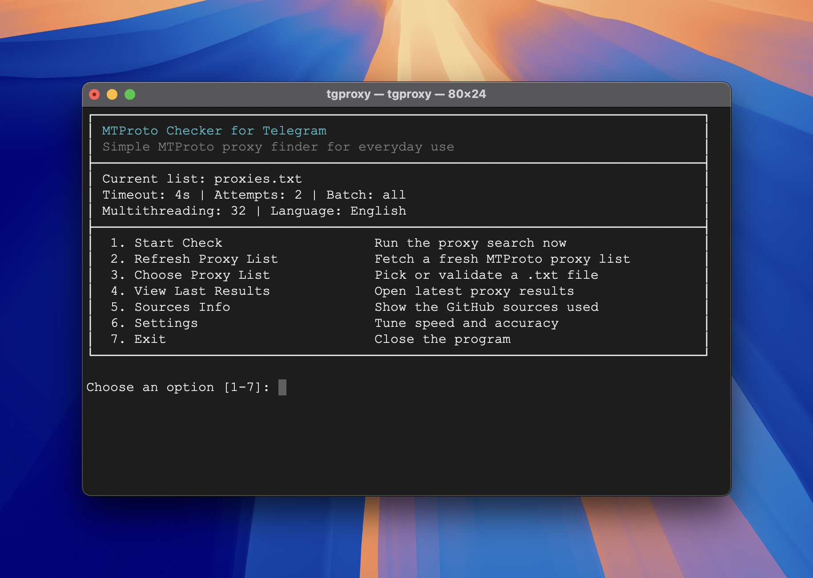

<div align="center">
  <h1>MTProto Checker for Telegram</h1>
  <p><strong>macOS</strong> · <strong>Windows</strong> · <strong>Linux</strong></p>
  <p>English · <a href="README.ru.md">Русский</a></p>
  <p>Update MTProto proxy lists from GitHub and check which Telegram proxies are actually usable.</p>
  
</div>

## Quick Start

### 1. Install Node.js

Install Node.js `16.20.2+` from [nodejs.org](https://nodejs.org/).

### 2. Install tgproxy

```bash
npm install -g tgproxy
```

### 3. Start the app

```bash
tgproxy
```

### 4. Run your first check

Choose the interface language, refresh or select a proxy list, and start the check.

## Update

To update tgproxy to the latest version:

```bash
npm install -g tgproxy@latest
```

## What It Does

- Refreshes built-in MTProto proxy lists from GitHub sources
- Lets you choose or validate a `.txt` file with `tg://proxy` or `https://t.me/proxy` links
- Runs an interactive terminal-first verification flow
- Works on macOS, Windows, and Linux
- Saves the latest working proxies to a plain `.txt` file
- Keeps the interface available in English and Russian

## Results Location

The latest working proxies are saved to:

- All platforms: `~/tgproxy/data/runtime/working_proxies.txt`

Put your own `.txt` proxy lists in `~/tgproxy/data/manual/` or choose any custom path from the menu.

## Proxy Sources

Built-in refresh uses public MTProto proxy lists from these GitHub repositories:

- [Argh94/Proxy-List](https://github.com/Argh94/Proxy-List)
- [SoliSpirit/mtproto](https://github.com/SoliSpirit/mtproto)
- [Argh94/telegram-proxy-scraper](https://github.com/Argh94/telegram-proxy-scraper)

## License

[MIT](LICENSE)
