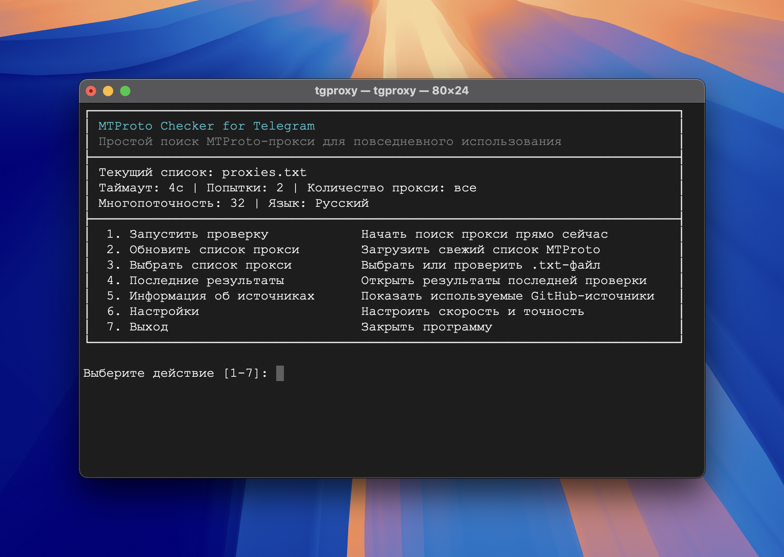

<div align="center">
  <h1>MTProto Checker for Telegram</h1>
  <p><a href="README.md">English</a> | Русский</p>
  <p>Обновляет списки MTProto-прокси из GitHub и помогает быстро понять, какие прокси для Telegram действительно работают.</p>
  
</div>

## Быстрый старт

### 1. Установите Node.js

Установите Node.js `16.20.2+` с [nodejs.org](https://nodejs.org/).

### 2. Установите tgproxy

```bash
npm install -g tgproxy
```

### 3. Запустите программу

```bash
tgproxy
```

### 4. Выполните первую проверку

Выберите язык интерфейса, обновите встроенный список или укажите свой и запустите проверку.

## Что умеет проект

- Загружает свежие списки MTProto-прокси из GitHub
- Принимает `.txt`-файлы со ссылками `tg://proxy` и `https://t.me/proxy`
- Работает через интерактивное меню в терминале
- Сохраняет последний список рабочих прокси в обычный `.txt`-файл
- Поддерживает русский и английский интерфейс

## Где лежат результаты

Последний список рабочих прокси сохраняется здесь:

- Все платформы: `~/tgproxy/data/runtime/working_proxies.txt`

Свои `.txt`-списки можно класть в `~/tgproxy/data/manual/` или выбирать любой путь через меню.

## Источники списков прокси

Встроенное обновление использует открытые списки MTProto-прокси из этих GitHub-репозиториев:

- [Argh94/Proxy-List](https://github.com/Argh94/Proxy-List)
- [SoliSpirit/mtproto](https://github.com/SoliSpirit/mtproto)
- [Argh94/telegram-proxy-scraper](https://github.com/Argh94/telegram-proxy-scraper)

## Лицензия

[MIT](LICENSE)
